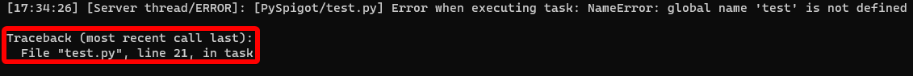
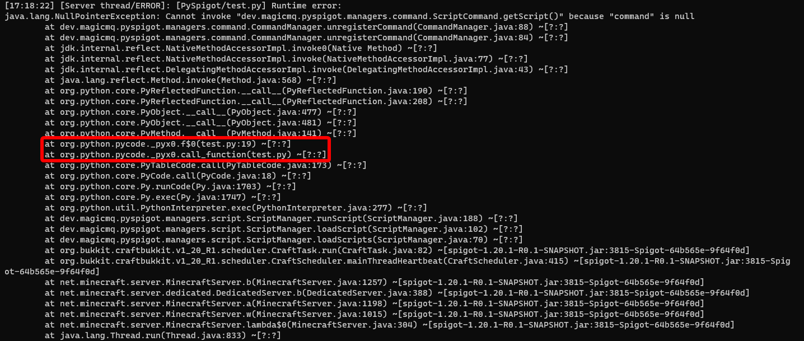

.. _writingscripts:

Scripts
=======

This page contains all information related to writing scripts.

.. note:: This tutorial provides an overview of PySpigot only, and does not cover in detail the Bukkit/Spigot API or writing Python code. Any questions concerning Python syntax or writing Python code in general should be redirected to the appropriate forum, as this tutorial will not provide an intoroduction to writing basic Python code.

Any questions concerning Python syntax or writing Python code in general should be redirected to the appropriate forum, as this tutorial will not provide an intoroduction to writing basic Python code.

Additionally, this tutorial will not explain how to use the Bukkit/Spigot API. Please see `Spigot's Website <https://www.spigotmc.org/>`__ and the `Spigot Javadocs <https://hub.spigotmc.org/javadocs/spigot/index.html?overview-summary.html>`__ for complete information on this.

There are a few guidelines that must be followed when writing PySpigot scripts. Please make sure to adhere to these guidelines at all times:

* Under the hood, PySpigot utilizes Jython, a Java implementation of Python. Currently, Jython implements Python 2 only, so Python 2 syntax should be used when writing PySpigot scripts.
* Scripts must be written in Python syntax and script files should in .py. Files that do not end in .py will not be loaded.
* Scripts are placed in the ``scripts`` folder under the PySpigot plugin folder.
* Avoid using the variable names ``global`` and ``logger``. These variable names are assigned automatically at runtime. More information on these below.
* Scripts are functionally isolated from one another. With the exception of the ``global`` variable (see the `Global Variables`_ section below), nothing is shared across scripts.
* To make use of any of the managers that PySpigot provides (such as registering listeners, tasks, etc.), they must be imported into your script. See the section below on Making Use of PySpigot's Managers for details.

A Note About Jython
###################

Under the hood, PySpigot utilizes Jython, a Java implementation of Python. The PySpigot jar file is quite large in comparison to other Spigot plugins because Jython (as well as its dependencies) are bundled into PySpigot.

Jython is written such that scripts are compiled and interpreted entirely in Java. This means that scripts have native access to the entire Java class path at runtime, making it very easy to work with the Spigot API and other aspects of the server. Consider the following example:

.. code-blod:: python

    from org.bukkit import Bukkit
    from org.bukkit import Location

    teleport_location = Location(Bukkit.getWorld('world'), 0, 64, 0)
    online_players = Bukkit.getOnlinePlayers()
    for player in online_players:
        player.teleport(teleport_location)

As you can see from the above code block, working with Java classes/objects is intuitive. Should you have any trouble interfacing with Java, Jython has fairly well-written documentation you can check out `here <https://jython.readthedocs.io/en/latest/>`__.

Currently, the latest version of Jython implements Python 2. Thus, for now, PySpigot scripts are written in Python 2. While some may see this as a drawback, Python 2 is usually sufficient for the vast majority of use cases of PySpigot, and I have not yet found any case where a Python 3 feature was required for script functionality. The developers of Jython intend on implementing Python 3 in a future release of Jython, but the expected timeframe of this update is unclear. Work is ongoing on the `Jython GitHub repository <https://github.com/jython/jython>`__.

For more information about Jython, visit `jython.org <https://www.jython.org/>`__.

Basic Script Information
########################

All PySpigot scripts are designed to be *self-contained*, single files. This means that each script will, at most, consist of one file only. Additionally, scripts are *isolated* from one another, meaning they do not share variables, functions, or scope. Scripts are capable of interacting with one another in various ways (more detail on this below), but think of each .py file in the ``scipts`` folder as an individual entity, executed in its own environment.

PySpigot scripts are placed in the ``scripts`` folder in PySpigot's main plugin folder. PySpigot will attempt to load any file in the ``scripts`` folder that ends in the ``.py`` extension. Any files in the ``scripts`` folder that do not end in ``.py`` will not be loaded.

Script Loading
***************

PySpigot loads and runs all scripts in the scripts folder automatically and in alphabetical order. This means that if a script depends on another script, then you should name it such that it falls after the script it depends on alphabetically (so it loads after the script it depends on).

There is one config option related to loading scripts:

* ``script-load-delay``: This is the delay, in ticks, that PySpigot will wait **after server loading is completed** to load scripts. For example, if the value is 20, then PySpigot will wait 20 ticks (or 1 second) after the server finishes loading to load scripts.

Of course, scripts can also be manually loaded using /pyspigot load <scriptname> if you want to load/enable a script after server start/plugin load.

Script Errors and Crashes
*************************

If a script happens to generate an unhandled error or exception during its execution, the script will be automatically unloaded. Additionally, any information related to the error will be printed to the server console.

If the error originated in a script's Python code (and not Java code), then a Python traceback will be printed to the console, along with a message indicating which script produced the error. If the error originated in Java code, then a Java stack trace will be provided along a message indicating which script produced the error.

.. _pyspigotmanagers:

PySpigot's Managers
*******************

PySpigot provides a variety of managers to more easily work with parts of the Bukkit/Spigot API. For instructions on importing these into your script, see below. PySpigot managers currently include:

* ListenerManager, for registering event listeners. This is accessed as ``listener`` under PySpigot, or imported individually as ``dev.magicmq.pyspigot.managers.listener.ListenerManager``.
* CommandManager, for registering and working with commands. This is accessed as ``commmand`` under PySpigot, or imported individually as ``dev.magicmq.pyspigot.managers.command.CommandManager``
* TaskManager, for registering a variety of repeating, delayed, and asynchronous tasks. This is accessed as ``scheduler`` under PySpigot, or imported individually as ``dev.magicmq.pyspigot.managers.task.TaskManager``
* ConfigManager, for working with configuration files. This is accessed as ``config`` under PySpigot, or imported individually as ``dev.magicmq.pyspigot.managers.config.ConfigManager``
* ProtocolManager, to work with ProtocolLib (this will only load if ProtocolLib is present on your server). This is accessed as ``protocol`` under PySpigot, or imported individually as ``dev.magicmq.pyspigot.managers.protocol.ProtocolManager``

.. note:: ProtocolManager is an *optional* manager. This manager is only accessible if the ProtocolLib plugin is present on the server when the PySpigot plugin is enabled. You will receive an error if you attempt to use the ProtocolManager when ProtocolLib is not present on the server.

To utilize these managers, they must be imported into your script. This can be done in two ways:

* Import all managers at once using the PySpigot class. This is the preferred way to import managers as less code is required:

  .. code-block:: python

      from dev.magicmq.pyspigot import PySpigot as ps

      ps.listener.<function>
      ps.command.<function>
      ps.scheduler.<function>
      ps.config.<function>
      ps.protocol.<function>

  In the above code, PySpigot is imported as ps. Managers are called using their simplified name, ``listener`` for ListenerManager, ``command`` for CommandManager, ``scheduler`` for TaskManager, ``config`` for ConfigManager, and ``protocol`` for ProtocolManager.

* Import each manager individually:

  .. code-block:: python

      from dev.magicmq.pyspigot.managers.listener import ListenerManager as listener
      from dev.magicmq.pyspigot.managers.command import CommandManager as command
      from dev.magicmq.pyspigot.managers.task import TaskManager as scheduler
      from dev.magicmq.pyspigot.managers.config import ConfigManager as config
      from dev.magicmq.pyspigot.managers.protocol import ProtocolManager as protocol

      listener.get().<function>
      command.get().<function>
      ...

  .. note:: If importing a manager individually, ``get`` *must* be used each time the manager is called!

Global Variables
################

PySpigot assigns a variable to the local namespace called ``global`` that is available to all loaded scripts. On the Java end, this variable is a ``HashMap``, which stores data in key:value pairs, much like a dict in Python. The intention of this variable is to act as a global set of variables. This is a nifty feature if you would like to share variables/values across multiple different scripts.

Changes to variables inserted into this global set are automatically visible to all scripts. There is no need to re-insert a variable into the global set of variables if its value changes.

* ``global.put(name, value)``: Inserts a new value into the global set of variables with the given name.
* ``global.get(name)``: Retrieves a value from the global set of variables. Will return ``None`` if no value is found.
* ``global.remove(name)``: Removes a value from the global set of variables with the given name.
* ``global.containsKey(name)``: Returns ``True`` if there is a value in the set of global variables with the given name, ``False`` if otherwise.

.. note:: Names are unique. If a new value is inserted into the set of global values with the same name as an existing value, then the old value will be overridden and inevitably lost.

For more advanced usage, see the `JavaDocs for HashMap <https://docs.oracle.com/javase/8/docs/api/java/util/HashMap.html>`__ for a complete list of available functions.

Script Logging
##############

Each script contains its own logger. Any errors and warnings that result from script execution will be printed to the console along with the script that produced the error and the

There are two types of errors that a script can produce:

Python Exceptions
*****************

These are exceptions intrinsic to the script's Python code. These exceptions will generate a log entry with a Python traceback indicating the script file and line that caused the exception. Because these exceptions originate in Python code, they should be fairly easy to debug. They will look like this:

The boxed text is the Python traceback.

Java Exceptions
***************

These exceptions occur when a script calls Java code and the exception occurs somewhere within the Java code (but not from within the script). These exceptions will generate a log entry with a `Java stack trace <https://www.javatpoint.com/java-stack-trace>`__ indicating where the exception occurred. These can be trickier to debug because the cause of the exception is not immediately apparent. Although these are Java stack traces, they also will indicate the script file and line that caused the exception. They will look like this:

The boxed text indicates where to find the script file and line that caused the exception. If the exception resulted from code that was called from within a function, the function name will also be given.

Let's take a look at the code that caused the exception in the above image to be thrown:

.. code-blod:: python
    :linenos:

    from dev.magicmq.pyspigot import PySpigot as ps

    kick_message = '&cYou have been kicked by %player%'

    def test_command(sender, label, args):
        print('Command issued!')
        return True

    ps.command.registerCommand(kick_command, 'kick_player')
    ps.command.unregisterCommand('command_does_not_exist')

On line 10, we attempt to unregister a command, but the command has not been registered, so this is most likely what caused the exception.

A Note About Exceptions
***********************

Because PySpigot is an active project in youth stages of development, you may encounter exceptions that are caused by a bug within PySpigot itself. If you encounter an exception, and your debug efforts have been futile, please `submit an issue on Github <https://github.com/magicmq/PySpigot/issues>`__.

Script Log Files
****************

By default, scripts log warnings and exceptions to an automatically generated log file. Each script has its own log file, and these can be found in the logs folder within the PySpigot plugin folder. If you would like to disable file logging for scripts, set the ``log-to-file`` value to ``false`` in PySpigot config.yml.

You may also change which messages are logged to a script's log file. To do so, edit the ``min-log-level`` value in the config.yml. Use Java's `Logging levels <https://docs.oracle.com/en/java/javase/11/docs/api/java.logging/java/util/logging/Level.html>`__.

You may also change the format of time stamps within script logs files. To do so, edit the ``log-timestamp-format`` value in the config.yml. Use Java's `DateTimeFormatter <https://docs.oracle.com/en/java/javase/11/docs/api/java.base/java/time/format/DateTimeFormatter.html>`__.